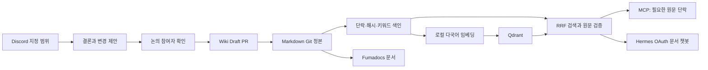

# Framework Wiki 개선 설계

2026-09-29 · 추적: [#17](https://github.com/team-framework/framework-llm-wiki-mcp/issues/17)

## 목표와 결정

Markdown 원문을 Git에 유지하고, 에이전트에는 질문에 필요한 단락만 전달한다. 사람은 Fumadocs에서 문서를 읽는다. 웹과 챗봇은 `team-framework` GitHub 회원만 접근한다.

세 가지 방식을 비교한 뒤, 사용자의 선호에 따라 **키워드 + 벡터 하이브리드 검색**을 선택했다. 응답 중복 제거와 부분 수정은 검색 방식과 함께 적용한다.

| 방식 | 읽기 | 생성·수정 | 비용과 한계 |
|---|---|---|---|
| 키워드 단락 검색 | 제목·경로·본문의 관련 단락 반환 | hash 검증 후 바뀐 단락만 교체 | 운영이 단순하지만 표현이 다른 질문을 놓칠 수 있음 |
| **키워드 + 벡터 검색** | 코드명·수치는 키워드, 표현 차이는 임베딩으로 찾고 RRF로 결합 | 같은 부분 수정 도구 사용 | 로컬 임베딩 계산과 색인 운영 필요 |
| 계층 요약·사실 카드 | 짧은 프로젝트·문서 개요를 먼저 읽고 원문 확장 | 변경된 카드만 재생성 | 조건·예외 누락과 요약 갱신 검증 필요 |

벡터 DB는 검색 후보를 찾는 보조 저장소다. 최종 근거와 Git diff는 Markdown 원문에서 생성한다. 새 사실을 작성하는 데 필요한 토큰은 남는다. 절감 대상은 중복 응답, 관련 없는 문서 내용, 전체 문서 재작성, 반복 운영 지침이다.

## 구성

### 검색과 색인

- Qdrant를 전용 Docker 서비스로 실행하고 데이터를 volume에 보관한다.
- 임베딩 모델은 `intfloat/multilingual-e5-small`, revision `614241f622f53c4eeff9890bdc4f31cfecc418b3`, 384차원 Cosine이다. CPU에서 실행하며 위키 원문을 외부 임베딩 API로 전송하지 않는다.
- `query:`와 `passage:` 접두사를 구분하고 벡터를 정규화한다. 480-token 창과 48-token 겹침을 사용하며 접두사·특수 토큰을 포함한 실제 입력이 512를 넘지 않는지 확인한다.
- 섹션을 여러 벡터로 나누더라도 RRF에는 해당 섹션이 한 번만 기여한다.
- 원문·모델·분할 규칙의 hash로 새 collection을 만든다. 완성 및 원문 재검증 후 alias를 교체한다. 실패하면 기존 색인을 유지한다.
- 검색 시 현재 원문 hash와 다른 벡터 결과를 제외한다. 벡터 장애·색인 중 상태는 응답에 표시하고 키워드 검색으로 계속 읽을 수 있게 한다.
- 변하지 않은 입력은 임베딩 캐시를 재사용한다. 기존 collection 삭제는 별도 보관 정책으로 다룬다.

[Qdrant collection·alias 문서](https://qdrant.tech/documentation/manage-data/collections/), [hybrid 검색 문서](https://qdrant.tech/documentation/search/hybrid-queries/), [임베딩 모델 카드](https://huggingface.co/intfloat/multilingual-e5-small).

### 토큰 절감과 수정

- `read_note`의 중복 `body`를 MCP 출력에서 제거하고 JSON 공백을 줄인다.
- 검색 결과에서 관련 단락을 선택하고 `get_context`, `get_note_outline`, `read_sections`로 확장한다.
- 표·코드블록을 예산 때문에 조용히 자르지 않는다. 필요한 추가 예산 또는 이어 읽기 정보를 반환한다.
- 편집 도구는 로컬 Git checkout에서 문서·섹션 hash를 비교한 뒤 요청한 부분만 바꾼다. 기본은 dry-run이며 MCP 읽기 서버가 정본을 직접 수정하지 않는다.
- 독립적인 원문 변경, 경로 이탈, 파일 충돌은 실패로 반환한다. 최종 검토는 GitHub Draft PR에서 수행한다.

### 웹과 Hermes

- Fumadocs는 실행 시 인증된 API에서 Markdown을 가져온다. 빌드 산출물에 비공개 위키를 넣지 않는다.
- Markdown은 문서로 렌더링하며 MDX 코드나 임의 HTML을 실행하지 않는다.
- 챗봇은 `gpt-6-luna`, `low`를 기본으로 사용하고 `none/low/medium/high/xhigh/max`를 선택할 수 있다.
- 서버의 Hermes OAuth 인증을 이용하는 별도 추론 경로에 근거·제한된 대화 기록을 보낸다. 이 경로는 shell·파일 수정·Hermes 전체 도구를 노출하지 않는다.
- 사실과 제안을 구분하고 출처 링크를 반환한다. API key·OAuth token은 브라우저에 전달하지 않는다.
- 문서 화면의 위키 Agent는 작은 창과 문서·채팅 분할 보기를 제공하며 `/chat`에서 채팅만 열 수 있다. 화면을 전환해도 같은 대화를 사용한다.
- 웹 대화 원문은 별도 SQLite에 저장한다. 로그인한 팀원이 함께 조회하고 이어서 질문하며, 모델 입력은 최근 대화 일부로 제한한다. 버전 검사와 요청 ID로 동시 작성·재시도 중복을 처리한다.

[Hermes API 안내](https://hermes-agent.nousresearch.com/docs/user-guide/features/api-server), [GPT-6 Luna 추론 강도](https://developers.openai.com/api/docs/models/gpt-6-luna), [Fumadocs](https://www.fumadocs.dev/docs).

### Discord

- 기존 Hermes gateway를 재사용하고 멘션 또는 Agent 답글 회신 때 대화에 참여한다.
- 요청한 범위 또는 설정된 주기의 메시지만 고정된 snapshot으로 수집한다. 읽지 않은 첨부·빠진 범위를 표시한다.
- 최종 결론과 diff를 원래 논의 공간에 제시한다. 해당 snapshot의 사람 참여자 누구나 승인할 수 있다.
- 승인은 proposal version·source hash·diff hash·대상 문서 hash에 묶는다. 변경되면 다시 확인받는다.
- 승인한 변경만 Draft PR로 만들고 중복 요청·중복 클릭·재시작을 처리한다. 자동 merge는 하지 않는다.
- 정기 수집은 대상과 간격을 지정한 후 활성화한다. 팀원이 사용할 명령·버튼은 별도 Bot 사용법에 기록한다.

## 검증 기준

같은 원문 snapshot에서 기존·개선 응답의 토큰 크기를 비교한다. tokenizer·문서 수·표본 질의·예산·생략 여부를 함께 기록한다. 과금량이나 전체 세션 절감률로 확대 해석하지 않는다.

검색은 한국어 바꿔 말하기, 코드 식별자, 수치, 다문서 질문, 과거/현행 구분을 확인한다. 수정은 요청 외 원문 보존과 충돌 차단을 확인한다. 인증·출처·웹 화면·실제 OAuth 응답·Discord 승인 경계를 따로 검증한다.
