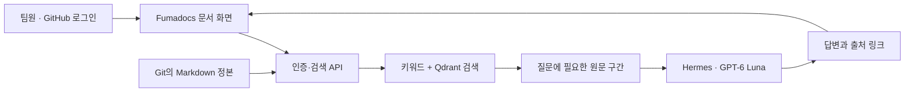
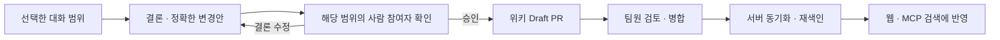

# Framework Wiki 개선 작업 안내

2026-09-30 기준. 위키 UI, Discord Bot, 사용 현황, 토큰 절약 방법을 설명한다. 기존 기술 문서는 아래에서 연결한다.

| 바로 보기 | 용도 |
| --- | --- |
| [위키 문서](https://framework-wiki.chaeyn.com/docs) | 팀 GitHub 로그인 후 문서 읽기·검색·Agent 질문 |
| [위키 채팅](https://framework-wiki.chaeyn.com/chat) | 채팅 전용 화면·팀 공용 대화 기록 |
| [Bot 사용법](https://framework-wiki.chaeyn.com/docs/bot-guide) | Discord 명령과 승인 절차 |
| [사용 현황](https://framework-wiki.chaeyn.com/docs/insights) | 기능 사용·재방문·토큰·팀 의견, JSON 저장 |

## 1. 위키 UI: 사람이 읽는 화면과 AI 검색을 함께 제공

### 어떤 구조로 만들었나

Markdown 원문은 기존 private Git 저장소에 둔다. Next.js와 Fumadocs로 만든 웹이 로그인한 사용자의 요청을 받아 위키 API에서 문서 목록과 본문을 가져온다. 프런트엔드 빌드에 비공개 문서 전체를 복사하지 않는다.

팀원은 문서 트리에서 주제를 찾거나 검색으로 문서를 연다. Agent 패널에서는 프로젝트 문맥을 묻고, 기존 문서 수정이나 새 문서의 초안을 요청할 수 있다. 개발 외에 디자인·기획·일정도 포함한다. 웹 Agent가 위키 원문을 직접 수정하거나 승인 없이 PR을 만드는 기능은 제공하지 않는다.

웹 Agent는 chaeyn 서버의 Hermes ChatGPT OAuth 연결을 사용한다. 기본 모델은 GPT-6 Luna, 추론 강도는 low다. 화면에서 none·low·medium·high·xhigh·max를 선택할 수 있다. 답변에는 근거 문서 링크를 붙인다. OAuth 토큰은 서버에 두며 브라우저에 전달하지 않는다.

### 문서를 보면서 대화하려면

문서 메뉴에는 **의견 보내기**, 오른쪽 아래에는 **위키 Agent**를 배치했다. Agent를 작은 창으로 열고 크기를 조절하거나, 문서와 채팅을 반반 나눠 볼 수 있다. `/chat`에서는 채팅만 넓게 사용한다.

대화 기록은 서버에 저장하며 로그인한 팀원이 함께 읽고 이어서 질문한다. 개인별 비공개 기록은 제공하지 않는다. 새 대화로 주제를 나눌 수 있고 화면 전환·새로고침 뒤에도 저장된 대화를 다시 연다. 이 기능을 도입하기 전에 브라우저 메모리에만 있던 대화는 서버에서 복원할 수 없다.

기록을 읽는 분량과 모델에 보내는 분량은 다르다. 전체 기록은 나눠 조회하고, 답변 생성에는 최근 최대 12개 메시지·24,000자를 사용한다. 두 팀원이 동시에 질문하면 먼저 저장된 버전을 확인하도록 안내한다. 같은 완료 요청을 재전송해도 질문·답변을 중복 저장하지 않는다.

### DisplayTitle·DisplayContent는 어떻게 쓰나

AI용 메타데이터와 상세 근거를 보존하면서, 같은 문서에 사람이 읽기 쉬운 제목과 설명을 추가할 수 있게 했다.

| 항목 | 역할 |
| --- | --- |
| `DisplayTitle` | 문서의 표시 제목 |
| `DisplayContent` | 사람이 읽는 Markdown 설명 |
| `DisplaySourceHash` | 설명을 작성할 때 참고한 원문 body의 SHA256 |

표시 본문이 있으면 웹에서 읽기 쉬운 설명을 보여주고, 같은 화면에서 원문으로 전환할 수 있다. 표시 본문이 없으면 원문을 보여준다. 원문이 바뀌어 저장된 hash가 달라지면 설명이 오래됐다고 알리고 최신 원문을 기본으로 보여준다. hash가 없는 문서는 이 방식으로 오래됨을 판정할 수 없다.

검색과 임베딩에는 원문을 사용한다. 표시 설명을 다시 색인해 같은 내용을 AI에 중복 전달하지 않는다. Display 필드는 선택 사항이며, 이번에 두 문서의 예시를 위키 PR #75로 반영했다. 전체 문서의 설명을 일괄 재작성한 것은 아니다.

화면의 **의견 보내기**에서는 버그·검색 실패·문서 이해 어려움·좋은 결과·느림·기타를 선택하고 내용을 적는다. 현재 페이지 경로와 화면 크기는 사용자가 첨부를 선택할 때만 보낸다. 다른 브라우저 탭이나 전체 로그를 수집하지 않는다.

상세: [웹 구현](../web/README.md), [표시 필드 규칙](human-readable-documents.md), [전체 구성](architecture.md).

## 2. Discord Bot: 대화 참여와 위키 반영을 구분

### 팀원이 사용하는 세 가지 기능

| 사용 방법 | 결과 |
| --- | --- |
| Agent 멘션 또는 Agent 메시지에 답글 | 논의에 참여해 질문에 답하고 관련 위키 근거·문서화 방향을 제안 |
| `/스레드-정리` | 논의에 참여하지 않은 팀원에게 전달할 요약 |
| `/위키-제안` | 선택한 대화의 결론과 기존 문서 수정·새 문서 추가안을 생성 |

일반 채팅 응답은 기존 Hermes gateway가 담당한다. 별도 위키 제안 처리기가 범위 수집, 변경안 작성, 참여자 승인, GitHub Draft PR 생성을 담당한다. Agent가 모든 메시지마다 끼어들도록 설정하지 않았다.

`/위키-제안`은 기본 최근 100개 메시지를 사용한다. 개수 또는 시작·끝 메시지 ID로 범위를 바꿀 수 있다. 예를 들어 branding의 로고 규칙은 디자인 가이드, 기능 범위 합의는 기획 문서, 발표 날짜와 담당자 합의는 일정 문서로 제안한다. 대화에 없는 날짜나 담당자를 만들지 않는다.

### 위키에 반영되는 순서

수집한 범위에 메시지를 남긴 사람 누구나 승인할 수 있다. 관리자라는 이유만으로 참여하지 않은 논의를 승인할 수는 없다. 봇 작성자는 승인자에 포함하지 않는다. 대화나 대상 문서가 바뀌면 기존 승인으로 처리하지 않고 다시 확인한다.

승인 뒤에는 LLM이 내용을 다시 작성하지 않는다. 사람이 확인한 변경안을 그대로 Draft PR로 만든다. 중복 클릭과 재시작을 처리하기 위해 제안·승인·발행 대기 상태를 SQLite에 보존한다. 자동 병합은 하지 않는다.

### 매일 자정에 확인하는 범위

한국 시간 자정에 innolive 카테고리 채널, branding, global과 연결된 공개 스레드를 확인한다. 일반 채팅과 보관된 공개 스레드도 포함하며, 마지막으로 저장한 범위 이후 메시지를 처리한다. DM·비공개 스레드·음성 대화는 포함하지 않는다.

기본 상한은 범위당 300개 메시지·출처 24,000자, 하루 3,000개 메시지다. 한도를 넘으면 남은 범위를 보존해 다음 처리로 넘긴다. 새로 남길 결정이 없으면 제안을 게시하지 않는다. 정기 수집도 사람의 승인 뒤 PR을 만든다.

첫 자동 수집은 47개 대상의 469개 메시지를 14개 범위로 처리했고, 모두 새 위키 변경이 필요 없다는 결과였다. 이 값은 초기 실행 기록이다. 실제 참여자의 승인부터 PR 생성까지 이어지는 전체 흐름은 이번 검증에서 대신 실행하지 않았으며, 승인·중복·충돌·재시도는 테스트로 검증했다.

GitHub App의 위키 접근 권한은 이 PR 생성에 필요하다. 하네스 PR #28에서 공통 스킬 배포 대상만 분리했으므로 권한을 제거할 필요는 없다.

상세: [팀원용 사용법](https://github.com/team-framework/framework-discord-bot/blob/main/docs/bot-usage.md), [운영·한도·복구](https://github.com/team-framework/framework-discord-bot/blob/main/docs/wiki-operations.md).

## 3. 사용 현황: 개선 효과를 다음 변경과 비교할 수 있게 기록

### 화면에서 볼 수 있는 것

[사용 현황](https://framework-wiki.chaeyn.com/docs/insights)에서 7·30·90일을 선택한다. 조회 시각과 표본 수가 포함된 JSON도 저장할 수 있다.

| 지표 | 확인할 질문 |
| --- | --- |
| 활동 팀원과 날짜별 요청 | 실제로 사용한 사람이 있는가? 사람 요청과 서비스 요청은 얼마나 되는가? |
| 기능별 사용·채택률 | 문서 검색·읽기·챗봇 중 어떤 기능을 사용하는가? |
| D1·D7 재방문 | 처음 관측한 날 이후 정확히 1일·7일 뒤 다시 사용하는가? |
| 검색 후 문서 열기·검색 결과 없음 | 검색이 문서 탐색으로 이어지는가? 못 찾는 질문이 얼마나 있는가? |
| 오류·처리 시간·잘린 응답 | 기능을 쓰는 과정에서 어디가 불편한가? |
| 답변 평가와 제품 의견 | 답이 도움이 됐는가? 어떤 불편을 먼저 고칠 것인가? |
| 토큰 비교와 제공자 사용량 | 반환 문맥을 얼마나 줄였고, 모델은 입력·출력 토큰을 얼마나 보고했는가? |

기능 채택률은 해당 기능을 사용한 사람 수를 같은 기간 전체 활동 사람 수로 나눈다. 재방문은 KST 날짜 기준이며, 아직 1일·7일이 지나지 않은 사람을 성숙한 표본처럼 계산하지 않는다. 최대 90일의 관측을 쓰므로 영구적인 가입일 기준 유지율과는 다르다. 날짜가 완전히 지난 표본만 재방문 분모에 넣는다. 최근 팀 의견 목록은 기간 선택과 별도로 최근 20개를 불러온다.

### 측정하지 않은 값은 0으로 만들지 않는다

계측 시작 전 날짜에는 **관측 자료 없음**을 표시한다. 클릭처럼 응답 속도를 재지 않는 행동에는 **측정 대상 아님**을 표시한다. 모델이 토큰 사용량을 반환하지 않으면 0으로 추정하지 않는다. 개발·자동 검증 요청과 봇 서비스 요청도 사람의 재방문율에 섞지 않는다.

로그에는 배포 버전, 사용 기능, 결과, 처리 시간, 토큰, 원문 버전 등을 남긴다. 사람 식별자는 GitHub 로그인명을 HMAC으로 변환한다. 자동 사용량 기록에는 질문·답변·문서·대화 원문, IP, 인증 토큰을 저장하지 않는다. 사용자가 직접 제출한 의견 원문은 팀이 읽을 수 있도록 별도로 저장한다. Discord 승인 검증용 대화 snapshot 역시 사용량 기록과 별도 보관한다.

웹 사용량과 의견은 영속 SQLite에 저장하고 기본 90일 후 정리한다. 봇의 제안 생성 결과·토큰은 봇의 별도 DB에도 남긴다. **Discord 제안→승인→PR 전환 통계를 웹 대시보드에서 한 번에 보는 기능은 아직 없다.**

### 앞으로 비교하는 방법

1. 변경을 배포할 때 버전을 기록하고 같은 길이의 관측 기간을 정한다.
2. 변경 전후의 활동 팀원 수, 기능 채택률, 검색 실패, 응답 평가, 토큰과 지연을 함께 비교한다.
3. 같은 요일 구성·모델·문서 버전·사람/서비스 비중인지 확인한다. 토큰 감소와 답변 품질 악화를 함께 점검한다.
4. 결과 JSON과 기간·표본 수·한계를 보존하고, 의견에서 반복된 불편을 다음 개선 대상으로 고른다.

지금은 계측 기반을 구축한 단계다. 아직 쌓이지 않은 재방문율이나 도입 전 운영 사용량을 성과처럼 제시하지 않는다. 장기 비교 자료는 90일 만료 전에 집계를 내보내 보존해야 한다.

상세: [지표 정의·분모·보관 계약](measurement-plan.md), [운영과 백업](operations.md).

## 4. 토큰 절약: 찾기·읽기·수정에서 반복되는 양을 줄임

### 검토한 세 가지 방식

| 방식 | 장점 | 한계와 선택 |
| --- | --- | --- |
| 키워드로 관련 구간만 검색 | 코드명·수치에 강하고 운영이 단순 | 질문 표현이 다르면 놓칠 수 있어 기본 검색으로 유지 |
| 키워드 + 벡터 검색 | 의미가 비슷한 표현까지 후보로 찾음 | 색인 운영이 필요하지만 근거 보완을 위해 채택 |
| 요약·사실 카드부터 읽기 | 짧은 개요로 시작 가능 | 예외 누락과 원문 변경 시 요약 갱신 검증 부담으로 주 방식에 채택하지 않음 |

Qdrant에는 원문 구간의 의미를 수치로 바꾼 벡터를 저장한다. 다국어 임베딩은 chaeyn 서버에서 계산한다. 키워드 순위와 벡터 순위를 합치고, 현재 원문과 일치하는 구간을 근거로 반환한다. 사람이 읽는 Markdown과 Git 변경 이력은 그대로 유지한다.

### 실제로 줄인 부분

- **전체 문서 반복 읽기:** 먼저 관련 구간을 받고, 근거가 부족할 때 목차와 필요한 구간을 추가로 읽는다. 잘린 결과에는 이어 읽을 방법을 반환한다.
- **응답 중복:** 같은 본문을 여러 필드로 반복 전달하거나 불필요한 JSON 공백을 보내는 양을 줄였다.
- **문서 전체 재작성:** 변경할 구간과 원문 hash를 지정해 부분 수정한다. 다른 사람이 먼저 고쳤으면 충돌을 알리고 덮어쓰지 않는다.
- **긴 작업 지침:** 스킬의 진입 지침을 짧게 만들고 상세 규칙을 필요한 단계에 읽게 나눴다.

### 같은 조건으로 비교한 결과

원문 157문서를 고정하고, 질문 10개와 필요한 근거 11개로 비교했다. 다음 값은 **첫 반환 payload**의 tokenizer 계산값이다.

| 방식 | 반환 토큰 | 기존 대비 감소 | 필요한 근거 발견 |
| --- | ---: | ---: | ---: |
| 기존 검색 + 상위 문서 전체 읽기 | 278,972 | 기준 | 6/11 |
| 키워드 구간 검색 | 54,448 | 80.48% | 8/11 |
| 키워드 + 벡터 구간 검색 | 54,502 | **80.46%** | **9/11** |

절감의 주된 이유는 필요한 구간만 읽고 중복을 줄인 것이다. 이 평가에서 벡터 결합은 키워드만 사용할 때보다 54토큰을 더 쓰면서 근거 1개를 추가로 찾았다. 질문별 필요한 근거를 모두 찾은 경우는 기존 5/10에서 hybrid 8/10으로 늘었다.

hybrid 첫 반환은 10개 중 9개 질문에서 예산 때문에 일부를 생략했다. 이후 재검색·이어 읽기·답변 생성 비용은 위 표에 포함하지 않는다. 찾지 못한 근거 2개도 남아 있다. **전체 작업 비용이나 실제 청구액이 80.46% 감소했다고 말할 수는 없다.**

| 별도 측정 | 결과 | 범위 |
| --- | ---: | --- |
| 부분 수정 20건 | 406,787 → 93,600, **76.99% 감소** | 실제 원문을 바꾸지 않은 합성 수정 요청 |
| 같은 본문으로 새 문서 생성 20건 | 54,898 → 57,175, **4.15% 증가** | 새 본문 양은 같고 프로토콜 오버헤드 추가 |
| wiki-update 진입 지침 | 7,434 → 551, **92.6% 감소** | 첫 지침만 비교, 이후 참고 문서 읽기는 별도 |

새 문서 작성 자체가 공짜가 되지는 않는다. 생성 전에 읽는 문맥과 반복 지침을 줄이는 방향이다. 실제 사용자 전체 작업에서 얼마나 절약되는지는 운영 사용량과 품질을 함께 관측해야 한다.

실험 JSON·CSV·재현 코드와 잘못 통제된 초기 비교도 보존했다. 초기 80.65% 수치는 원문 버전이 섞여 최종 결과에서 제외했다. 위 표는 원문과 벡터 색인을 맞춰 다시 측정한 80.46%다.

상세: [비교 자료 모음](benchmarks/2026-09-29/README.md), [부분 읽기·수정 도구](token-efficient-tools.md), [재현과 운영 측정](measurement-plan.md).

## 확인한 상태와 남은 일

문서·Bot·Display 예시·스킬 개선 PR과 위키 동기화 제외 PR은 병합됐다. 위키 문서, Bot 가이드, 사용 현황 API의 인증된 응답 200과 벡터 색인 ready를 재확인했다. 하네스 제외 변경은 Actions에서 위키를 빼고 다른 4개 저장소를 처리한 실행과 webhook 배포 성공을 확인했다.

위키의 [기존 자동 배포 실행](https://github.com/team-framework/framework-llm-wiki-mcp/actions/runs/36580789412)은 `systemctl --user`가 사용자 세션 bus 환경을 찾지 못해 실패했다. [수정 PR #23](https://github.com/team-framework/framework-llm-wiki-mcp/pull/23)에서 실행 계정의 bus 환경을 설정하고 연결·재시작 상태를 검사하도록 고쳤다. 이어진 [자동 배포 실행 36584735096](https://github.com/team-framework/framework-llm-wiki-mcp/actions/runs/36584735096)이 성공했다. 운영 release가 병합 commit `c09981d6fc8e19e4c188b5db73194622dddbe63f`와 일치하며, 인증 문서 200·미인증 302·벡터 ready·실제 챗봇 답변과 출처 반환을 확인했다.

API/MCP 테스트 61개, Bot 테스트 36개, 하네스 제외 테스트 13개와 각 작업의 타입 검사·관련 빌드를 확인했다. 실제 Hermes OAuth 답변·출처·usage 반환과 의견 저장은 초기 배포 때 검증했다. 실제 팀원이 Discord 제안을 승인해 PR을 만드는 사용 장면과 장기간 재방문·만족도 효과는 이번 검증 범위 밖이다.

개발 세션 자체의 토큰·API 환산은 위키 운영 지표와 별도다. [세션 비용 자료](session-usage-method.md)는 21:44:59 KST 관측값에 Luna만 Fast를 적용한 $103.54를 기록한다. 이후 후속 작업의 사용량은 그 snapshot에 포함하지 않는다.

관련 변경: [서버·웹 #18](https://github.com/team-framework/framework-llm-wiki-mcp/pull/18), [Bot #6](https://github.com/team-framework/framework-discord-bot/pull/6), [표시 예시 #75](https://github.com/team-framework/framework-llm-wiki/pull/75), [공통 스킬 #26](https://github.com/team-framework/framework-agent-harness-sync/pull/26), [위키 배포 제외 #28](https://github.com/team-framework/framework-agent-harness-sync/pull/28).
